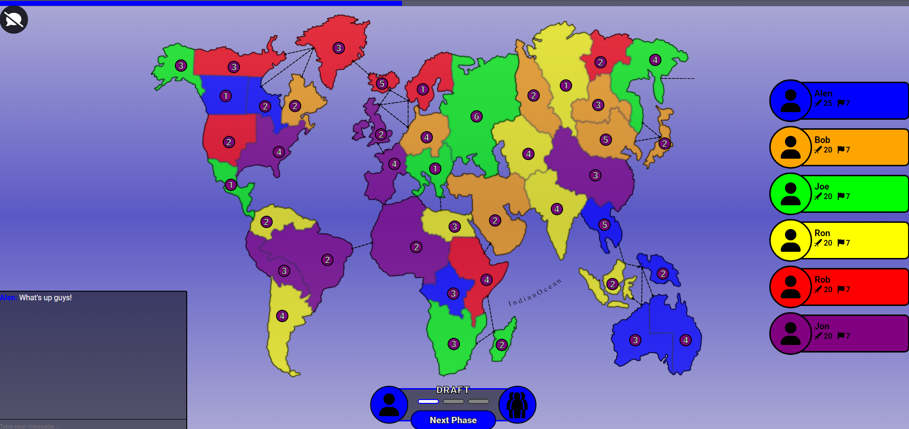
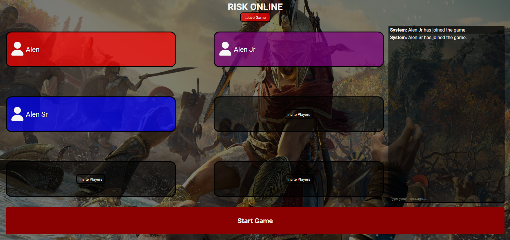

# Capstone Project
The project aimed to recreate the classic board game Risk, featuring an interactive map divided into territories where players compete for global domination. The game is turn-based, and during each turn, players move through three phases: draft, attack, and reinforce. The game also includes a real-time multiplayer chat feature and a timer to manage player turns.

A reflection paper and analysis of the development process technically documented can be viewed here:

[View Project Paper](/Reflection%20paper%20-%20Capstone.pdf) (Some personal information has been redacted)

## Installation Instructions
- Pull the repository
- Navigate to frontend and backend
- npm install (both directories)
- npm run dev (both directories)

## Screenshots

